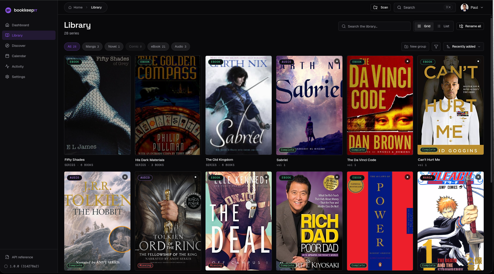

<div align="center">

# bookkeeprr

**Self-hosted media manager for the things the \*arr stack ignores - manga, comics, light novels, ebooks, and audiobooks.**

[](https://github.com/paulcsiki/bookkeeprr/actions/workflows/ci.yml)
[](https://github.com/paulcsiki/bookkeeprr/releases)
[](./LICENSE)
[](https://github.com/paulcsiki/bookkeeprr/pkgs/container/bookkeeprr)
[](https://www.bookkeeprr.com/discord)

[Website & live demo](https://www.bookkeeprr.com) · [Documentation](./docs) · [Discussions](https://github.com/paulcsiki/bookkeeprr/discussions) · [Issues](https://github.com/paulcsiki/bookkeeprr/issues) · [Discord](https://www.bookkeeprr.com/discord)

<br/>



<sub>Your whole library - manga, comics, light novels, ebooks, and audiobooks - in one place.</sub>

</div>

---

Sonarr and Radarr nailed TV and movies. Readarr and LazyLibrarian handle books reluctantly. **bookkeeprr** is built from the ground up for the formats they treat as second-class: manga, comics, light novels, ebooks, and audiobooks - with the metadata adapters, quality profiles, and naming logic each one actually needs.

It's a single container, self-hosted, runs on **your** database, **your** library, and **your** indexer credentials. No telemetry, no phone-home - the only outbound traffic is the API calls you configure. You bring your own qBittorrent.

## Features

- **Five content types, first-class** - manga, comics, light novels, ebooks, audiobooks, each with type-aware metadata, covers, and flows.
- **Rich metadata hydration** - AniList, MangaDex, Google Books, Open Library, ComicVine, and NovelUpdates, with cover + year backfill chains per content type.
- **Indexer-driven** - sits on top of the indexers you bring (Prowlarr/Torznab, Nyaa, MyAnonaMouse, and more) and orchestrates search, matching, and grabs.
- **qBittorrent automation** - monitors series, grabs new volumes, and routes downloads into a clean, templated library.
- **Configurable naming engine** - per-content-type templates so every grab lands where you expect.
- **Import & scan** - point it at existing folders; read-only by default, with an opt-in one-time rename.
- **Built-in reader** - read manga, comics, ebooks (EPUB/MOBI/AZW3 via foliate-js), and more, on web and mobile, with progress sync and offline downloads.
- **Library groups, eight themes, light/dark** - an opinionated, polished UI that's actually pleasant to live in.
- **Optional auth** - forms, OIDC federation, or reverse-proxy, configured at runtime under Settings. No secrets in your compose file.
- **Notifications** - stay on top of new releases and grabs.

See it running on the **[live demo at bookkeeprr.com](https://www.bookkeeprr.com)**.

## Quick start (Docker)

bookkeeprr ships as a single image. Drop this `docker-compose.yml` into your stack, mount a volume for the database and one for your media root, and you're done:

```yaml
services:
  bookkeeprr:
    image: ghcr.io/paulcsiki/bookkeeprr:1.0.0   # or :latest for the newest build
    container_name: bookkeeprr
    restart: unless-stopped
    ports:
      - "3000:3000"
    environment:
      TZ: Europe/Stockholm
    volumes:
      - ./config:/config        # database + logs
      - /srv/media:/media        # your library root
    healthcheck:
      test: ["CMD", "wget", "-qO-", "http://localhost:3000/api/health"]
      interval: 30s
      timeout: 5s
      retries: 3
```

```bash
docker compose up -d
```

Then open `http://localhost:3000`, point it at your qBittorrent and indexers under **Settings**, and add your first series. To upgrade: bump the tag and `docker compose pull && docker compose up -d` - bookkeeprr migrates its database itself.

### Configuration

Everything operational is configured in the **Settings** UI at runtime. A few low-level knobs are environment variables (all optional - sensible defaults ship in the container):

| Variable | Purpose | Default (container) |
| --- | --- | --- |
| `BOOKKEEPRR_DB_PATH` | SQLite database file | `/config/bookkeeprr.db` |
| `BOOKKEEPRR_CONFIG_DIR` | Mutable config (DB, backups, logs) | `/config` |
| `BOOKKEEPRR_MEDIA_ROOT` | Parent of your library folders | `/media` |
| `BOOKKEEPRR_PORT` | HTTP port | `3000` |
| `BOOKKEEPRR_LOG_LEVEL` | `fatal`\|`error`\|`warn`\|`info`\|`debug`\|`trace` | `info` |
| `TZ` | Timezone | - |

See [`docs/deploy.md`](./docs/deploy.md) for the full deployment guide and [`apps/web/.env.example`](./apps/web/.env.example) for the complete list.

## Documentation

| Doc | What's in it |
| --- | --- |
| [`docs/use.md`](./docs/use.md) | Using bookkeeprr day to day |
| [`docs/deploy.md`](./docs/deploy.md) | Self-hosting & deployment |
| [`docs/api.md`](./docs/api.md) | HTTP API reference (OpenAPI) |
| [`docs/build.md`](./docs/build.md) | Building from source |
| [`docs/maintain.md`](./docs/maintain.md) | Operations & maintenance |

## Building from source

This repository is a **pnpm-workspaces monorepo** (Next.js 16, TypeScript, Drizzle ORM + SQLite, Tailwind v4, React Native).

```bash
pnpm install
pnpm dev          # web app on http://localhost:3000

pnpm test         # run the test suites
pnpm typecheck    # type gate
pnpm lint         # lint gate
pnpm build:web    # production build of the web app
```

Requires Node 20+ and [pnpm](https://pnpm.io) (`packageManager` is pinned in `package.json`). Full contributor guide: [`docs/build.md`](./docs/build.md).

### Monorepo layout

| Path | Description |
| --- | --- |
| `apps/web/` | Next.js 16 + worker app - the main bookkeeprr service |
| `apps/mobile/` | React Native app (iOS/Android) |
| `apps/website/` | Marketing site (static export) |
| `packages/tokens/` | Design tokens (CSS + JS), consumed by all apps |
| `packages/types/` | Shared Zod schemas + TS types for domain models |
| `packages/logic/` | Pure helpers (ISBN, formatters) - React Native safe |
| `packages/ui/` | Web React UI primitives - web-only |

## Contributing

Issues and pull requests are welcome. Use [GitHub Issues](https://github.com/paulcsiki/bookkeeprr/issues) for bugs and [Discussions](https://github.com/paulcsiki/bookkeeprr/discussions) for questions, and run `pnpm test`, `pnpm typecheck`, and `pnpm lint` before opening a PR. There's a community [Discord](https://www.bookkeeprr.com/discord) too.

## License

[MIT](./LICENSE) - do what you want. If you ship it as a service, please don't call it bookkeeprr.
